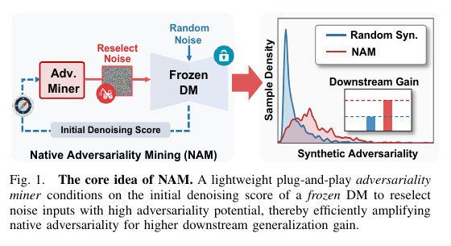
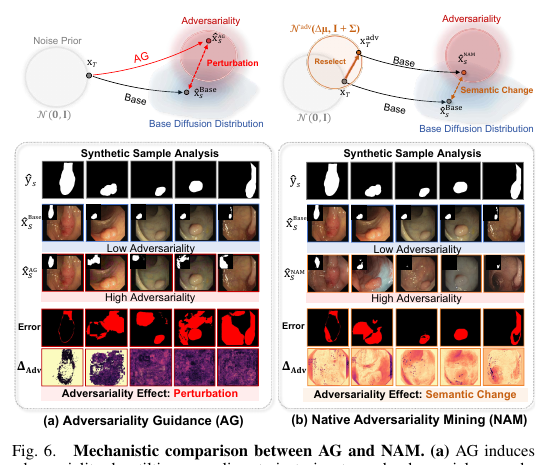
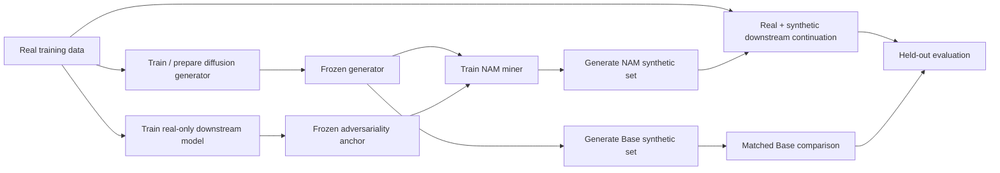

<h1 align="center">🔥 Native Adversariality Mining (NAM)</h1>

<p align="center">
  <b>Mining Native Adversariality in Diffusion Models for Medical Generalization</b>
</p>

<p align="center">
  Official PyTorch implementation of <b>Native Adversariality Mining (NAM)</b>, including the extended TPAMI experiments and the CVPR 2026 preliminary work.
</p>

<p align="center">
  <a href="https://openaccess.thecvf.com/content/CVPR2026/papers/Zhang_Diffusion-Based_Native_Adversarial_Synthesis_for_Enhanced_Medical_Segmentation_Generalization_CVPR_2026_paper.pdf">
    
  </a>
  <a href="#-publications">
    
  </a>
  <a href="pyproject.toml">
    =3.10">
  </a>
  <a href="https://pytorch.org/">
    =2.1">
  </a>
  <a href="LICENSE">
    
  </a>
</p>

<p align="center">
  <a href="https://github.com/JackCD99/Native-Adversariality-Mining/stargazers">
    
  </a>
  <a href="https://github.com/JackCD99/Native-Adversariality-Mining/network/members">
    
  </a>
  <a href="https://github.com/JackCD99/Native-Adversariality-Mining/commits/main">
    
  </a>
  <a href="https://github.com/JackCD99/Native-Adversariality-Mining/issues">
    
  </a>
</p>

<p align="center">
  📄 <a href="https://openaccess.thecvf.com/content/CVPR2026/papers/Zhang_Diffusion-Based_Native_Adversarial_Synthesis_for_Enhanced_Medical_Segmentation_Generalization_CVPR_2026_paper.pdf">CVPR Paper</a>
  &nbsp;·&nbsp;
  📎 <a href="https://openaccess.thecvf.com/content/CVPR2026/supplemental/Zhang_Diffusion-Based_Native_Adversarial_CVPR_2026_supplemental.pdf">CVPR Supplement</a>
  &nbsp;·&nbsp;
  🧪 <a href="docs/TABLE1_PROTOCOL.md">Table I Protocol</a>
  &nbsp;·&nbsp;
  📊 <a href="docs/EVALUATION_VISUALIZATION.md">Evaluation Guide</a>
  &nbsp;·&nbsp;
  🐛 <a href="https://github.com/JackCD99/Native-Adversariality-Mining/issues">Issues</a>
</p>

---

## 🧭 Navigation

- [🌟 Overview](#-overview)
- [💡 Why NAM?](#-why-nam)
- [🧠 Method at a glance](#-method-at-a-glance)
- [🏆 Representative results](#-representative-results)
- [🧪 What can be reproduced](#-what-can-be-reproduced)
- [🚀 Quick start](#-quick-start)
- [⚙️ Installation](#️-installation)
- [🗂️ Repository structure](#️-repository-structure)
- [🧩 Configuration system](#-configuration-system)
- [📦 Datasets](#-datasets)
- [🧬 Supported diffusion models](#-supported-diffusion-models)
- [🧠 Downstream models](#-downstream-models)
- [🔁 Reproduction workflows](#-reproduction-workflows)
- [📊 Evaluation and visualization](#-evaluation-and-visualization)
- [🛡️ Mitigation strategies](#️-mitigation-strategies)
- [💾 Checkpoints and outputs](#-checkpoints-and-outputs)
- [🧪 Reproducibility checklist](#-reproducibility-checklist)
- [🧰 Extending the repository](#-extending-the-repository)
- [❓ FAQ and troubleshooting](#-faq-and-troubleshooting)
- [📚 Publications](#-publications)
- [📝 Citation](#-citation)

---

## 📢 News

- **August 2026** — Public release of the TPAMI-oriented NAM codebase, including 2D/3D synthesis, M2I/M&I/T2I branches, transfer experiments, analysis utilities, and defective-mode mitigation.
- **June 2026** — The preliminary work, *Diffusion-Based Native Adversarial Synthesis for Enhanced Medical Segmentation Generalization*, was presented at **CVPR 2026** and selected as a **Highlight** paper. 🌟

---

## 🌟 Overview

Diffusion models have become powerful medical-image generators, but **high visual fidelity alone does not guarantee that synthetic data will improve a downstream model**. Randomly generated samples are often dominated by already well-learned modes, while the samples that expose meaningful downstream weaknesses can be sparse.

**Native Adversariality Mining (NAM)** is designed to find these informative hard samples directly from a pretrained diffusion model. NAM learns a lightweight miner that uses the diffusion model's early denoising response to reselect the initial noise. The resulting seeds are more likely to generate samples with high downstream difficulty while preserving the base diffusion process.

In the intended NAM workflow:

- the **diffusion generator is frozen**;
- the **downstream anchor is frozen**;
- only the lightweight **NAM miner** is optimized;
- generation still uses the original diffusion sampling process;
- synthetic data are evaluated under the same downstream training and fixed-budget protocol as Base sampling.

<p align="center">
  
</p>

> [!TIP]
> If you are new to the repository, start with the **Polyps + SiameseDiff + nnU-Net** example in `configs/table1_2d.yaml`. It is the most convenient end-to-end entry point for understanding the training, mining, generation, and evaluation flow.

### ✨ Repository highlights

| Capability | What is available |
|---|---|
| 🎯 **Native adversariality mining** | Trainable 2D and 3D NAM miners with frozen diffusion/downstream models |
| 🧬 **Multiple synthesis paradigms** | 2D M2I, 2D M&I, 3D M2I, and text-to-image branches |
| 🩺 **Medical benchmarks** | MRI, CT, CTA, endoscopy, dermoscopy, and chest X-ray settings |
| 🌍 **Generalization evaluation** | In-domain, cross-center, cross-modality, natural-image transfer, and classification |
| 🧠 **Multiple downstream families** | nnU-Net, Swin-Unet/SwinUNETR, SAMed, ResNet-50, ViT-S/16, DeepLabV3, Mask2Former |
| 📊 **Analysis toolkit** | adversariality distributions, FID, t-SNE, cross-model consistency, CSV/JSON exports |
| 🛡️ **Defective-mode mitigation** | HAT, QSF, LSRS, and ASG sampling-time strategies |
| ⚙️ **Configuration-driven runs** | YAML experiment configs plus CLI overrides, validation, and dry runs |
| 📈 **Experiment tracking** | TensorBoard, JSONL metrics, environment snapshots, previews, sample metadata |
| 🧪 **Paper-oriented reproduction** | Table I matrix, fixed seeds, fixed budgets, and documented training/evaluation order |

---

## 💡 Why NAM?

### Random diffusion augmentation can be redundant

A standard synthetic-data pipeline usually samples initial noise from the base Gaussian prior and accepts every generated sample with equal probability. When a generator and downstream model are trained from the same limited task data, this process can repeatedly synthesize dominant modes that the downstream model already handles well.

NAM instead asks a different question:

> **Which seeds are more likely to expose underlearned but generator-supported modes?**

The method treats downstream difficulty as a signal for locating these modes before the expensive full generation step.

### Native versus artificial adversariality

The paper distinguishes two forms of high downstream difficulty:

- **Native adversariality** — hard samples associated with difficult modes that remain compatible with the base diffusion distribution.
- **Artificial adversariality** — difficulty induced by attack-style perturbations or trajectory guidance that can move synthesis away from the base distribution and become highly model-specific.

<p align="center">
  
</p>

A practical difference is summarized below:

| Property | Random Base sampling | NAM | Adversarial guidance |
|---|---|---|---|
| Diffusion model updated? | No | No | No |
| Sampling trajectory modified? | No | No | **Yes** |
| Initial seed distribution adapted? | No | **Yes** | Usually no |
| Downstream difficulty targeted? | No | **Yes** | Yes |
| Goal | generic synthesis | informative native hard modes | attack-style difficulty |
| Typical alignment behavior in the paper | base reference | near-base / mild shift | often stronger degradation |
| Cross-model transfer in the paper | task-dependent | comparatively strong | often weaker / model-specific |

> [!NOTE]
> NAM is **not training-free**: the miner is trained for the selected generator/task/anchor configuration. The key efficiency property is that NAM does **not retrain the diffusion model** and introduces only a small additional cost at synthesis time after the miner has been trained.

---

## 🧠 Method at a glance

### 🔹 Standard Base sampling

```text
x_T ~ N(0, I)
      |
      v
frozen diffusion model
      |
      v
synthetic sample
```

### 🔹 NAM sampling

```text
probe noise x_T ~ N(0, I)
        |
        v
initial denoising score / response
        |
        v
    NAM miner M_xi
        |
        v
predicted noise-distribution shift
        |
        v
reselected noise x_T^adv
        |
        v
frozen diffusion model + original sampler
        |
        v
native-adversarial synthetic sample
```

### 🔹 End-to-end training flow



### 🔬 What the miner sees

The miner is conditioned on the diffusion model's **initial denoising response**, rather than only on raw random noise. This gives the miner information about how the frozen generator interprets a candidate seed before full synthesis.

For the main experiments, miner optimization uses a **truncated early DDIM rollout** to reduce training cost. Full deterministic DDIM sampling is retained for final generation.

### ⚖️ Main NAM objective components

The implementation exposes the main ingredients used in the paper:

- an adversariality reward derived from the frozen downstream model;
- a cap `kappa_up` that prevents unrestricted pursuit of extreme loss;
- KL regularization controlled by `beta` to keep the reselected noise distribution close to the base prior;
- a truncated differentiable rollout for efficient miner optimization.

The exact implementation depends on the generator adapter and spatial dimensionality.

---

## 🏆 Representative results

The following numbers are **representative manuscript-reported gains over the real-only downstream baseline**. They are included as reference points for reproduction; exact results can vary with hardware, dependency versions, preprocessing, and stochastic training.

### 📈 In-domain medical segmentation

| Dataset / generator | Downstream | Base synthesis gain | NAM gain |
|---|---|---:|---:|
| ACDC / DiffBoost | nnU-Net | +3.50 DSC | **+8.26 DSC** |
| ACDC / DiffBoost | Swin-Unet | +2.28 DSC | **+8.39 DSC** |
| Synapse / DiffBoost | nnU-Net | +4.09 DSC | **+9.49 DSC** |
| Synapse / DiffBoost | Swin-Unet | +3.17 DSC | **+8.56 DSC** |
| Polyps / SiameseDiff | nnU-Net | +5.05 DSC | **+10.74 DSC** |
| Polyps / SiameseDiff | Swin-Unet | +4.38 DSC | **+9.80 DSC** |
| Polyps / SiameseDiff | SAMed | +4.60 DSC | **+10.00 DSC** |
| LA / MAISI | nnU-Net | +2.66 DSC | **+4.84 DSC** |
| ImageCAS / MAISI | nnU-Net | +3.06 DSC | **+6.30 DSC** |

### 🌍 Transfer settings

The extended experiments also include:

- cross-center polyp segmentation on EndoScene/CVC-300, CVC-ColonDB, and ETIS;
- MRI↔CT cross-modality evaluation on MMWHS;
- medical classification on PneumoniaMNIST-224 and ISIC;
- natural-image segmentation on PASCAL VOC 2012 + SBD.

In the manuscript's transfer experiments, NAM improves the average gain of the task-specific diffusion baseline in both medical classification and natural-image segmentation.

### ⚡ Reference efficiency

For the reported SiameseDiff experiment on a single RTX 4090:

| Sampling mode | Reported time / image |
|---|---:|
| Standard DDIM | 7.41 s |
| **NAM** | **7.85 s** |
| NatADiff reference | 176.91 s |

These values are hardware- and implementation-specific and should be treated as reference measurements rather than fixed requirements.

---

## 🧪 What can be reproduced

The public code is organized around four major experiment groups.

### 1️⃣ In-domain medical segmentation

- **ACDC** — cardiac MRI
- **Synapse** — abdominal CT
- **Polyps** — CVC-ClinicDB + Kvasir-SEG
- **LA** — 3D left-atrium MRI
- **ImageCAS** — 3D coronary CTA

### 2️⃣ Cross-domain medical generalization

- **Cross-center:** EndoScene/CVC-300, CVC-ColonDB, ETIS-LaribPolypDB
- **Cross-modality:** MMWHS MRI ↔ CT

### 3️⃣ Task transfer

- **PneumoniaMNIST-224** — medical image classification
- **ISIC** — skin-lesion classification

### 4️⃣ Domain transfer

- **PASCAL VOC 2012 + SBD** — natural-image semantic segmentation

### 🧾 Main experiment matrix

`configs/table1_matrix.yaml` defines the primary generator/dataset/downstream combinations and the three paper seeds:

```text
42, 3407, 2026
```

The main matrix includes:

| Dataset | Modality | Spatial dims | Main generators | Downstream models |
|---|---|---:|---|---|
| ACDC | MRI | 2D | SegDiff, DiffBoost, JoDiffusion | nnU-Net, Swin-Unet, SAMed |
| Synapse | CT | 2D | FairDiff, DiffBoost, MedSegFactory | nnU-Net, Swin-Unet, SAMed |
| Polyps | RGB | 2D | SegDiff, DiffBoost, SiameseDiff, MedSegFactory | nnU-Net, Swin-Unet, SAMed |
| LA | MRI | 3D | VolDiT, MAISI | nnU-Net, SwinUNETR, SAMed |
| ImageCAS | CTA | 3D | VolDiT, MAISI | nnU-Net, SwinUNETR, SAMed |

List the configured Table I cells with:

```bash
python scripts/list_table1.py
```

---

## 🚀 Quick start

This section gives the shortest path from a fresh clone to a validated NAM configuration.

### 1. Clone the repository

```bash
git clone https://github.com/JackCD99/Native-Adversariality-Mining.git
cd Native-Adversariality-Mining
```

### 2. Create a Python environment

```bash
python -m venv .venv
```

Linux/macOS:

```bash
source .venv/bin/activate
```

Windows PowerShell:

```powershell
.venv\Scripts\Activate.ps1
```

### 3. Install NAM

Install the correct PyTorch build for your CUDA environment first, then:

```bash
python -m pip install --upgrade pip
pip install -e ".[medical,diffusion,visualization]"
```

### 4. Validate the default experiment

```bash
python scripts/train_nam_2d.py \
  --config configs/table1_2d.yaml \
  --dry-run \
  --print-config
```

A successful dry run confirms that the configuration file can be loaded and that the configured factories can be imported. It does **not** load the real dataset, initialize large weights, or start optimization.

### 5. Inspect the paper matrix

```bash
python scripts/list_table1.py
```

> [!IMPORTANT]
> A dry run is only a configuration check. A full experiment still requires the corresponding dataset, upstream generator source code where applicable, pretrained generator weights, and a real-data downstream checkpoint.

---

## ⚙️ Installation

### 📌 Core requirements

- Python **3.10+**
- PyTorch **2.1+**
- CUDA-capable GPU for diffusion/NAM training
- Linux recommended for full reproduction
- sufficient local storage for raw datasets, pretrained diffusion weights, downstream checkpoints, and generated synthetic samples

The manuscript experiments were run on **four RTX 4090 GPUs**. Individual pipelines may use fewer devices, but memory and runtime requirements vary substantially across 2D latent diffusion, pixel-space diffusion, and 3D volumetric synthesis.

### 📦 Core Python dependencies

The package metadata includes the following core dependencies:

| Package | Minimum version |
|---|---:|
| NumPy | 1.24 |
| Pillow | 10.0 |
| PyYAML | 6.0 |
| SciPy | 1.11 |
| TensorBoard | 2.14 |
| PyTorch | 2.1 |
| tqdm | 4.66 |

### 🧩 Optional dependency groups

Install only what is needed for the selected branch.

```bash
# Medical imaging
pip install -e ".[medical]"

# Diffusion pipelines
pip install -e ".[diffusion]"

# Natural-image transfer
pip install -e ".[natural]"

# Classification
pip install -e ".[classification]"

# 3D / volumetric diffusion
pip install -e ".[volumetric-diffusion]"

# Plotting and t-SNE
pip install -e ".[visualization]"

# Chest-X-ray utilities
pip install -e ".[xray]"

# VQA-based mitigation
pip install -e ".[mitigation-vqa]"
```

<details>
<summary><b>📚 Optional dependency groups in <code>pyproject.toml</code></b></summary>

| Group | Main packages | Typical use |
|---|---|---|
| `medical` | MONAI, nibabel, h5py | medical segmentation / 3D data |
| `diffusion` | diffusers, PEFT, safetensors | Stable-Diffusion-style pipelines |
| `natural` | torchvision, transformers, accelerate | PASCAL VOC + ControlNet/SDXL |
| `classification` | torchvision, timm | ResNet / ViT classification |
| `volumetric-diffusion` | MONAI, nibabel, OmegaConf, einops, timm | VolDiT / MAISI branches |
| `visualization` | matplotlib, scikit-learn, torchvision | t-SNE and analysis plots |
| `xray` | torchxrayvision | X-ray branch |
| `mitigation-vqa` | transformers, accelerate | QSF / VQA-based mitigation |

</details>

### 🐧 Linux notes

Most full experiments and upstream medical-generation repositories are easiest to reproduce on Linux. When an upstream generator has its own environment file or CUDA extension requirements, follow the upstream installation instructions first, then install NAM in editable mode.

### 🪟 Windows notes

Windows is suitable for:

- reading/configuring experiments;
- dry-run validation;
- code inspection;
- many pure-PyTorch components.

Some upstream diffusion/medical packages may assume Linux shell commands, symlinks, or CUDA build tooling. WSL2 is often the simplest option if native Windows compatibility becomes a bottleneck.

---

## 🗂️ Repository structure

```text
Native-Adversariality-Mining/
├── assets/                         # README figures
├── configs/                        # YAML experiment configurations
├── docs/                           # paper reproduction / evaluation notes
├── nam/
│   ├── data/                       # dataset packages and split manifests
│   ├── diffusion/
│   │   ├── 2D_M2I/                # 2D mask-to-image generators
│   │   ├── 2D_M&I/                # joint image-mask generators
│   │   ├── 2D_T2I/                # text-to-image branch
│   │   └── 3D_M2I/                # volumetric mask-to-image generators
│   ├── downstream/                 # downstream models and trainers
│   │   ├── real_checkpoint/        # real-only baselines / NAM anchors
│   │   └── syn_checkpoint/         # synthetic-augmented models
│   ├── engine/                     # shared execution layer
│   ├── evaluation/                 # metrics and visualization utilities
│   ├── mitigation/                 # HAT / QSF / LSRS / ASG
│   └── utils/                      # configuration, logging, seeds, I/O
├── pretrained_weights/             # documentation for external weights
├── scripts/                        # command-line entry points
├── pyproject.toml
├── requirements.txt
└── README.md
```

### 🔎 Where should I look first?

| Goal | Start here |
|---|---|
| Run the default 2D experiment | `configs/table1_2d.yaml` |
| Inspect all main paper cells | `configs/table1_matrix.yaml` |
| Train NAM | `scripts/train_nam_2d.py` / `train_nam_3d.py` |
| Generate synthetic samples | `scripts/generate_2d.py` / `generate_3d.py` |
| Train downstream models | `scripts/train_downstream_2d.py` / `train_downstream_3d.py` |
| Evaluate segmentation | `scripts/evaluate_2d.py` / `evaluate_3d.py` |
| Evaluate classification | `scripts/evaluate_classification.py` |
| Compute adversariality | `scripts/evaluate_adversariality.py` |
| Compute FID | `scripts/evaluate_fid.py` |
| Reproduce Table I protocol | `docs/TABLE1_PROTOCOL.md` |
| Reproduce visual analyses | `docs/EVALUATION_VISUALIZATION.md` |
| Understand split inventory | `nam/data/SPLITS.md` |

---

## 🧩 Configuration system

Experiments are controlled by YAML files in `configs/`. The command-line entry points share a small set of common options:

```text
--config PATH
--set KEY=VALUE [KEY=VALUE ...]
--dry-run
--print-config
--log-level {DEBUG,INFO,WARNING,ERROR}
```

### 🧪 Validate before launching

```bash
python scripts/train_nam_2d.py \
  --config configs/table1_2d.yaml \
  --dry-run \
  --print-config
```

### ✏️ Override individual values

```bash
python scripts/train_nam_2d.py \
  --config configs/table1_2d.yaml \
  --set runtime.seed=3407 training.reward=lcbce
```

### 🧱 Configuration anatomy

A typical experiment configuration contains sections like:

```yaml
experiment_name: polyps-siamesediff-nnunet

runtime:
  device: cuda
  seed: 42
  num_workers: 4
  output_dir: outputs

dataset:
  factory: nam.data.polyps.dataset:build_dataset
  root: nam/data/polyps

diffusion:
  name: siamesediff
  checkpoint: nam/diffusion/2D_M2I/siamesediff/checkpoints/diffusion/polyps/best_fid.ckpt
  full_schedule_steps: 50

anchor:
  name: nnunet
  checkpoint: nam/downstream/real_checkpoint/polyps/nnunet/best.pt

training:
  max_iterations: 3000
  learning_rate: 0.0001
  beta: 0.001
  kappa_up: 0.5
  truncated_steps: 10

sampling:
  budget: 1128
  ddim_steps: 50
```

The complete configuration includes generator-specific and downstream-specific options; the example above only shows the most important fields.

### 📚 Main configuration files

| Configuration | Intended use |
|---|---|
| `configs/table1_2d.yaml` | Polyps + SiameseDiff + nnU-Net reference experiment |
| `configs/table1_3d.yaml` | 3D reference experiments |
| `configs/table1_matrix.yaml` | main Table I generator/dataset/downstream matrix |
| `configs/segdiff_2d.yaml` | SegDiff branch |
| `configs/diffboost_2d.yaml` | DiffBoost branch |
| `configs/fairdiff_2d.yaml` | FairDiff branch |
| `configs/jodiffusion_2d.yaml` | JoDiffusion branch |
| `configs/medsegfactory_2d.yaml` | MedSegFactory branch |
| `configs/voldit_3d.yaml` | VolDiT branch |
| `configs/maisi_3d.yaml` | MAISI branch |
| `configs/controlnet_sdxl_voc.yaml` | PASCAL VOC + SBD transfer |
| `configs/sd15_lora_pneumoniamnist.yaml` | PneumoniaMNIST classification |
| `configs/sd15_lora_isic.yaml` | ISIC classification |
| `configs/mitigation.yaml` | mitigation studies |

---

## 📦 Datasets

Raw datasets are **not redistributed**. Each dataset package contains the local loader, expected split manifests, and a preparation README.

### 📊 Split inventory

| Scenario | Dataset | Modality / task | Train | Val | Test | Typical resolution |
|---|---|---|---:|---:|---:|---|
| In-domain | ACDC | cardiac MRI segmentation | 4,010 | 572 | 1,146 | 256×256 |
| In-domain | Synapse | abdominal CT segmentation | 2,645 | 378 | 756 | 256×256 |
| In-domain / source | CVC-ClinicDB + Kvasir-SEG | RGB polyp segmentation | 1,128 | 161 | 323 | 256×256 |
| 3D | LA | left-atrium MRI segmentation | 70 | 10 | 20 | 192×192×96 |
| 3D | ImageCAS | coronary CTA segmentation | 700 | 100 | 200 | 192×192×96 |
| Cross-center | EndoScene / CVC-300 | polyp evaluation | — | — | 60 | 256×256 |
| Cross-center | CVC-ColonDB | polyp evaluation | — | — | 380 | 256×256 |
| Cross-center | ETIS-LaribPolypDB | polyp evaluation | — | — | 196 | 256×256 |
| Cross-modality | MMWHS CT | whole-heart segmentation | 3,714 | 531 | 1,060 | 256×256 |
| Cross-modality | MMWHS MRI | whole-heart segmentation | 2,029 | 290 | 579 | 256×256 |
| Natural image | PASCAL VOC 2012 + SBD | semantic segmentation | 8,422 | 1,203 | 2,406 | 512×512 |
| Classification | PneumoniaMNIST-224 | chest X-ray classification | 4,099 | 585 | 1,171 | 224×224 |
| Classification | ISIC | dermoscopic classification | 1,925 | 275 | 550 | 256×256 |

Detailed inventory: [`nam/data/SPLITS.md`](nam/data/SPLITS.md)

### 📝 Manifest formats

Segmentation:

```text
sample_id relative/image/path relative/target/path [optional prompt]
```

Classification:

```text
sample_id relative/image/path class_id [optional prompt]
```

### 📁 Expected dataset layout

A typical package looks like:

```text
nam/data/<dataset>/
├── README.md
├── dataset.py
├── train.list
├── val.list
├── test.list
└── data/               # local raw / processed data; ignored by Git
```

### 🩻 Example: Polyps

The Polyps benchmark combines **CVC-ClinicDB** and **Kvasir-SEG**. The local preparation guide uses a unified 7:1:2 split with seed 42 and expects binary masks at 256×256 resolution.

Example manifest rows:

```text
kvasir_0001 data/images/kvasir_0001.jpg data/masks/kvasir_0001.png
clinicdb_0001 data/images/clinicdb_0001.tif data/masks/clinicdb_0001.tif
```

See [`nam/data/polyps/README.md`](nam/data/polyps/README.md).

<details>
<summary><b>🔗 Dataset sources</b></summary>

- **ACDC:** cardiac segmentation challenge
- **Synapse:** multi-organ CT segmentation dataset
- **CVC-ClinicDB:** polyp segmentation dataset
- **Kvasir-SEG:** polyp segmentation dataset
- **LA:** Atrial Segmentation Challenge
- **ImageCAS:** coronary artery CTA dataset
- **EndoScene / CVC-300:** cross-center polyp evaluation
- **CVC-ColonDB:** cross-center polyp evaluation
- **ETIS-LaribPolypDB:** cross-center polyp evaluation
- **MMWHS:** multi-modality whole-heart segmentation
- **PASCAL VOC 2012:** natural-image semantic segmentation
- **SBD:** Semantic Boundaries Dataset
- **PneumoniaMNIST-224:** MedMNIST chest X-ray classification
- **ISIC:** skin-lesion image classification

Please follow the license and use conditions of each original dataset.

</details>

> [!WARNING]
> Do not modify split membership when comparing against the reported experiments. Changes to preprocessing, subject-level partitioning, slice filtering, or train/validation/test membership can produce results that are not directly comparable to the manuscript.

---

## 🧬 Supported diffusion models

NAM is integrated with multiple generator families. Upstream repositories and large pretrained weights are intentionally kept separate from this repository.

| Generator | Synthesis paradigm | Noise / latent space | Main datasets | Local guide | Upstream |
|---|---|---|---|---|---|
| **SegDiff** | mask → image | 2D pixel DPM | ACDC, Polyps | [`README`](nam/diffusion/2D_M2I/segdiff/README.md) | [segmentation-guided diffusion](https://github.com/mazurowski-lab/segmentation-guided-diffusion) |
| **DiffBoost** | mask → image | 2D latent diffusion | ACDC, Synapse, Polyps | [`README`](nam/diffusion/2D_M2I/diffboost/README.md) | [DiffBoost](https://github.com/NUBagciLab/DiffBoost) |
| **FairDiff** | mask → image | 2D latent diffusion | Synapse | [`README`](nam/diffusion/2D_M2I/fairdiff/README.md) | [FairDiff](https://github.com/wenyi-li/FairDiff) |
| **SiameseDiff** | mask → image | 2D Stable Diffusion latent | Polyps | [`README`](nam/diffusion/2D_M2I/siamesediff/README.md) | [Siamese-Diffusion](https://github.com/Qiukunpeng/Siamese-Diffusion) |
| **JoDiffusion** | image + mask | joint 2D latent diffusion | ACDC | [`README`](nam/diffusion/2D_M%26I/jodiffusion/README.md) | [JoDiffusion](https://github.com/00why00/JoDiffusion) |
| **MedSegFactory** | image + mask | dual-stream 2D latent diffusion | Synapse, Polyps | [`README`](nam/diffusion/2D_M%26I/medsegfactory/README.md) | [MedSegFactory](https://github.com/jwmao1/MedSegFactory) |
| **VolDiT** | mask → volume | 3D latent DiT | LA, ImageCAS | [`README`](nam/diffusion/3D_M2I/voldit/README.md) | [VolDiT](https://github.com/Cardio-AI/voldit) |
| **MAISI** | mask → volume | 3D latent diffusion | LA, ImageCAS | [`README`](nam/diffusion/3D_M2I/maisi/README.md) | [MONAI MAISI](https://github.com/Project-MONAI/tutorials/tree/main/generation/maisi) |
| **ControlNet-SDXL** | semantic mask → image | 2D latent diffusion | PASCAL VOC + SBD | [`README`](nam/diffusion/2D_M2I/controlnet_sdxl/README.md) | [ControlNet](https://github.com/lllyasviel/ControlNet) |
| **SD-v1.5 + LoRA** | text → image | 2D latent diffusion | PneumoniaMNIST, ISIC | [`README`](nam/diffusion/2D_T2I/sd15_lora/README.md) | [Stable Diffusion v1.5](https://huggingface.co/stable-diffusion-v1-5/stable-diffusion-v1-5) |

### 🔢 Noise layouts used by the main matrix

| Generator | Channels | Spatial size | Notes |
|---|---:|---|---|
| SegDiff | dataset image channels | 256×256 | pixel-space noise |
| DiffBoost | 4 | 32×32 | latent diffusion |
| FairDiff | 4 | 32×32 | latent diffusion |
| SiameseDiff | 4 | 32×32 | latent diffusion |
| JoDiffusion | 8 | 32×32 | joint image-mask latent |
| MedSegFactory | 4 | 32×32 | dual-noise branch |
| VolDiT | 8 | 24×24×12 | 3D latent |
| MAISI | 4 | 48×48×24 | 3D latent |

### 🔌 Upstream generator setup

Most generator adapters expect the original implementation to be available separately, typically below a configurable `third_party/` directory.

For example, SiameseDiff:

```bash
git clone https://github.com/Qiukunpeng/Siamese-Diffusion.git third_party/Siamese-Diffusion
```

The adapter README explains where to place weights and which upstream configuration is expected.

---

## 🧠 Downstream models

The repository separates **real-only training** from **synthetic-augmented continuation**.

| Model | Primary task | Dimensionality | Reference |
|---|---|---:|---|
| **nnU-Net** | medical segmentation | 2D / 3D | [MIC-DKFZ/nnUNet](https://github.com/MIC-DKFZ/nnUNet) |
| **Swin-Unet** | medical segmentation | 2D | [HuCaoFighting/Swin-Unet](https://github.com/HuCaoFighting/Swin-Unet) |
| **SwinUNETR** | volumetric segmentation | 3D | [MONAI SwinUNETR](https://github.com/Project-MONAI/research-contributions/tree/main/SwinUNETR) |
| **SAMed** | medical segmentation | 2D / slice-wise 3D evaluation | [hitachinsk/SAMed](https://github.com/hitachinsk/SAMed) |
| **DeepLabV3-R50** | natural-image segmentation | 2D | [Torchvision](https://pytorch.org/vision/stable/models/deeplabv3.html) |
| **Mask2Former-R50** | natural-image segmentation | 2D | [Mask2Former](https://github.com/facebookresearch/Mask2Former) |
| **ResNet-50** | medical classification | 2D | [Torchvision](https://pytorch.org/vision/stable/models/resnet.html) |
| **ViT-S/16** | medical classification | 2D | [timm](https://github.com/huggingface/pytorch-image-models) |

### 💾 Checkpoint namespaces

Real-only checkpoints:

```text
nam/downstream/real_checkpoint/<dataset>/<model>/
├── best.pt
├── latest.pt
└── epoch_XXXX.pt
```

Synthetic-augmented checkpoints:

```text
nam/downstream/syn_checkpoint/<dataset>/<generator>/<model>/
├── best.pt
├── latest.pt
└── epoch_XXXX.pt
```

`best.pt` is selected using validation performance. The real-only `best.pt` is used as the frozen downstream anchor for NAM unless another anchor is explicitly configured.

See [`nam/downstream/README.md`](nam/downstream/README.md) for model-specific details.

---

## 🔁 Reproduction workflows

### 🎯 Recommended first reproduction: Polyps + SiameseDiff + nnU-Net

The default configuration is:

```text
configs/table1_2d.yaml
```

This setting uses:

- Polyps dataset;
- SiameseDiff as the generator;
- nnU-Net as the anchor and default downstream model;
- 4×32×32 latent noise;
- 50-step deterministic DDIM for final synthesis;
- 1,128 synthetic samples by default, matching the real training-set size.

#### Step 1 — Prepare the dataset

Follow:

```text
nam/data/polyps/README.md
```

Expected split sizes:

```text
train: 1128
val:    161
test:   323
```

#### Step 2 — Prepare SiameseDiff

```bash
git clone https://github.com/Qiukunpeng/Siamese-Diffusion.git third_party/Siamese-Diffusion
```

Read:

```text
nam/diffusion/2D_M2I/siamesediff/README.md
```

The default configuration expects the task diffusion checkpoint at:

```text
nam/diffusion/2D_M2I/siamesediff/checkpoints/diffusion/polyps/best_fid.ckpt
```

If training the generator locally:

```bash
python scripts/train_diffusion_2d.py \
  --config configs/table1_2d.yaml
```

#### Step 3 — Train the real-only downstream model

```bash
python scripts/train_downstream_2d.py \
  --config configs/table1_2d.yaml \
  --phase real
```

Expected validation-selected anchor:

```text
nam/downstream/real_checkpoint/polyps/nnunet/best.pt
```

#### Step 4 — Train NAM

```bash
python scripts/train_nam_2d.py \
  --config configs/table1_2d.yaml
```

Main defaults:

| Hyperparameter | Value |
|---|---:|
| Optimizer | AdamW |
| Learning rate | 1e-4 |
| Weight decay | 1e-2 |
| Miner iterations | 3,000 |
| `beta` | 0.001 |
| `kappa_up` | 0.5 |
| Truncated rollout | 10 steps |
| Final DDIM | 50 steps |

#### Step 5 — Generate NAM samples

```bash
python scripts/generate_2d.py \
  --config configs/table1_2d.yaml \
  --method nam
```

#### Step 6 — Generate matched Base samples

```bash
python scripts/generate_2d.py \
  --config configs/table1_2d.yaml \
  --method base
```

Base and NAM comparisons should use the same generator checkpoint, condition list, synthetic budget, resolution, DDIM schedule, and downstream training procedure.

#### Step 7 — Train with synthetic data

```bash
python scripts/train_downstream_2d.py \
  --config configs/table1_2d.yaml \
  --phase synthetic
```

The Table I protocol uses matched real/synthetic batches and a 1:1 real-to-synthetic ratio.

#### Step 8 — Evaluate

```bash
python scripts/evaluate_2d.py \
  --config configs/table1_2d.yaml \
  --checkpoint-phase real

python scripts/evaluate_2d.py \
  --config configs/table1_2d.yaml \
  --checkpoint-phase syn

python scripts/evaluate_adversariality.py \
  --config configs/table1_2d.yaml

python scripts/evaluate_fid.py \
  --config configs/table1_2d.yaml
```

### 🧪 Full Table I protocol

Every main experiment cell follows the same high-level dependency order:

1. prepare the real-data split;
2. train or register the corresponding generator;
3. train the real-only downstream baseline;
4. freeze the generator and adversariality anchor;
5. train NAM for 3,000 iterations;
6. synthesize a fixed budget with deterministic DDIM-50;
7. continue downstream training with matched real/synthetic batches;
8. select checkpoints using validation data;
9. report final metrics on the held-out test split;
10. repeat for the configured seeds `42`, `3407`, and `2026`.

See [`docs/TABLE1_PROTOCOL.md`](docs/TABLE1_PROTOCOL.md).

### 🩻 General 2D workflow

```bash
# 1. generator
python scripts/train_diffusion_2d.py --config <CONFIG>

# 2. real baseline / anchor
python scripts/train_downstream_2d.py --config <CONFIG> --phase real

# 3. NAM
python scripts/train_nam_2d.py --config <CONFIG>

# 4. synthesis
python scripts/generate_2d.py --config <CONFIG> --method nam
python scripts/generate_2d.py --config <CONFIG> --method base

# 5. synthetic continuation
python scripts/train_downstream_2d.py --config <CONFIG> --phase synthetic

# 6. evaluation
python scripts/evaluate_2d.py --config <CONFIG> --checkpoint-phase syn
python scripts/evaluate_adversariality.py --config <CONFIG>
python scripts/evaluate_fid.py --config <CONFIG>
```

### 🧊 3D workflow

```bash
python scripts/train_diffusion_3d.py --config configs/table1_3d.yaml
python scripts/train_downstream_3d.py --config configs/table1_3d.yaml --phase real
python scripts/train_nam_3d.py --config configs/table1_3d.yaml
python scripts/generate_3d.py --config configs/table1_3d.yaml --method nam
python scripts/generate_3d.py --config configs/table1_3d.yaml --method base
python scripts/train_downstream_3d.py --config configs/table1_3d.yaml --phase synthetic
python scripts/evaluate_3d.py --config configs/table1_3d.yaml --checkpoint-phase syn
python scripts/evaluate_adversariality.py --config configs/table1_3d.yaml --spatial-dims 3
```

### 🌿 Natural-image transfer

PASCAL VOC 2012 + SBD uses the ControlNet-SDXL branch.

```bash
python scripts/train_diffusion_2d.py --config configs/controlnet_sdxl_voc.yaml
python scripts/train_downstream_2d.py --config configs/controlnet_sdxl_voc.yaml --phase real
python scripts/train_nam_2d.py --config configs/controlnet_sdxl_voc.yaml
python scripts/generate_2d.py --config configs/controlnet_sdxl_voc.yaml --method nam
python scripts/train_downstream_2d.py --config configs/controlnet_sdxl_voc.yaml --phase synthetic
python scripts/evaluate_2d.py --config configs/controlnet_sdxl_voc.yaml --checkpoint-phase syn
```

### 🩺 Medical classification transfer

PneumoniaMNIST-224 and ISIC use the SD-v1.5 + LoRA branch.

```bash
python scripts/train_diffusion_2d.py \
  --config configs/sd15_lora_pneumoniamnist.yaml

python scripts/train_downstream_2d.py \
  --config configs/sd15_lora_pneumoniamnist.yaml \
  --phase real

python scripts/train_nam_2d.py \
  --config configs/sd15_lora_pneumoniamnist.yaml

python scripts/generate_2d.py \
  --config configs/sd15_lora_pneumoniamnist.yaml \
  --method nam

python scripts/train_downstream_2d.py \
  --config configs/sd15_lora_pneumoniamnist.yaml \
  --phase synthetic

python scripts/evaluate_classification.py \
  --config configs/sd15_lora_pneumoniamnist.yaml
```

Switch to `configs/sd15_lora_isic.yaml` for ISIC.

---

## 📊 Evaluation and visualization

### 📏 Task metrics

| Task | Main metrics |
|---|---|
| Medical segmentation | DSC ↑, ASD ↓ |
| Natural-image segmentation | mIoU ↑ |
| Classification | accuracy ↑, plus configured class metrics |
| Synthetic alignment | FID ↓ |
| Synthetic adversariality | LCE / LCBCE / LDice-derived scores |

### 🎯 Adversariality evaluation

```bash
python scripts/evaluate_adversariality.py \
  --config configs/table1_2d.yaml
```

Choose a proxy:

```bash
python scripts/evaluate_adversariality.py \
  --config configs/table1_2d.yaml \
  --proxy lce
```

The exported table can include:

```text
id
path
lce
lcbce
ldice
adv_lce
adv_lcbce
adv_ldice
adv
```

The normalized convention is **larger = harder** under the selected downstream model.

The evaluator preserves dataset order, truncates to the requested fixed budget, and does not add new perturbations to already generated samples.

### ⚖️ Adversariality reward variants

Available NAM reward choices include:

```text
lce
lcbce
ldice
lfocal
```

Example override:

```bash
python scripts/train_nam_2d.py \
  --config configs/table1_2d.yaml \
  --set training.reward=lcbce
```

### 🌌 FID / distribution alignment

```bash
python scripts/evaluate_fid.py \
  --config configs/table1_2d.yaml
```

When comparing Base and NAM, keep the following fixed:

- feature extractor;
- real reference split;
- synthetic budget;
- image preprocessing;
- output resolution.

### 🎨 Publication visualizations

Install visualization dependencies:

```bash
pip install -e ".[visualization]"
```

Then run:

```bash
python -m nam.evaluation.Vis.tsne
python -m nam.evaluation.Vis.adversariality_distribution
python -m nam.evaluation.Vis.cross_model_consistency
```

#### t-SNE

The t-SNE analysis uses frozen downstream bottleneck features and projects configured groups jointly. Both the source features and projected coordinates are saved for inspection.

#### Adversariality distributions

The plotting utilities can produce histogram / density-style summaries and sample-level rankings from the exported adversariality files.

#### Cross-model consistency

Cross-model consistency aligns records using the exact sample `id` intersection and reports:

- Pearson correlation;
- Spearman rank correlation;
- mean absolute difference.

This supports analysis of whether samples identified as hard by one anchor remain difficult for another downstream architecture.

More details: [`docs/EVALUATION_VISUALIZATION.md`](docs/EVALUATION_VISUALIZATION.md)

---

## 🛡️ Mitigation strategies

High-adversariality mining can also expose defective modes already present in a generator. The extended code includes four optional sampling-time mitigation strategies.

| Strategy | Main idea | Additional requirement |
|---|---|---|
| **HAT** | replace samples above a calibrated adversariality threshold; retry candidate seeds | adversariality scoring |
| **QSF** | evaluate generated samples with a configurable VQA-based quality/semantic score | VQA model / optional dependencies |
| **LSRS** | rerank candidates using full, unconditional, and component-conditioned diffusion predictions | cached diffusion states / generator hooks |
| **ASG** | use cross/self-attention signals to suppress incompatible generations | attention access in supported generators |

All four strategies are applied **after NAM has been trained**; the generator, downstream anchor, and NAM miner remain frozen during mitigation sampling.

Configuration:

```text
configs/mitigation.yaml
```

Implementation:

```text
nam/mitigation/
```

Detailed guide: [`nam/mitigation/README.md`](nam/mitigation/README.md)

> [!NOTE]
> Mitigation is optional. It can improve sample quality in settings where defective modes are noticeable, but some strategies add substantial inference cost and may reject useful hard samples. For direct paper reproduction, use the configuration associated with the target experiment.

---

## 💾 Checkpoints and outputs

Large model binaries are not stored in Git. The repository expects pretrained generators and locally trained checkpoints at documented paths.

### 🧬 Diffusion checkpoints

Each generator adapter README describes:

- upstream repository;
- expected source revision / model configuration;
- pretrained weights;
- checkpoint filenames;
- task-specific training or registration steps.

Example SiameseDiff layout:

```text
nam/diffusion/2D_M2I/siamesediff/
├── pretrained_weights/
├── checkpoints/
│   ├── diffusion/<dataset>/
│   ├── nam/<dataset>/
│   └── downstream/<dataset>/<model>/
└── README.md
```

### 🧠 Downstream checkpoints

Real baseline / anchor:

```text
nam/downstream/real_checkpoint/<dataset>/<model>/best.pt
```

Synthetic-augmented model:

```text
nam/downstream/syn_checkpoint/<dataset>/<generator>/<model>/best.pt
```

### 🎯 NAM miner checkpoint

The miner output path is configuration-dependent. The default Polyps/SiameseDiff example uses an output path similar to:

```text
outputs/polyps-siamesediff-nnunet/checkpoints/nam_latest.pt
```

### 📂 Experiment artifacts

A run can produce:

```text
outputs/<experiment>/
├── checkpoints/
├── tensorboard/
├── visualizations/
├── metrics.jsonl
├── config.json
├── environment.json
└── samples.jsonl
```

| Artifact | Description |
|---|---|
| `checkpoints/` | latest / best / periodic training states |
| `tensorboard/` | scalar curves, histograms, images, diagnostics |
| `visualizations/` | PNG previews and analysis panels |
| `metrics.jsonl` | append-only machine-readable metrics |
| `config.json` | fully resolved configuration used for the run |
| `environment.json` | Python, PyTorch, CUDA and environment metadata |
| `samples.jsonl` | generated sample IDs, conditions, prompts, seeds, checkpoints, output paths |

### 📈 TensorBoard

```bash
tensorboard --logdir outputs --port 6006
```

### 🔍 Why keep `config.json` and `environment.json`?

They make it much easier to distinguish:

- a code change from a configuration change;
- a different seed from a different data split;
- a dependency-version difference from an algorithmic difference;
- Base/NAM runs that accidentally used different checkpoints or budgets.

---

## 🗺️ Paper-to-code map

| Paper component | Main repository entry |
|---|---|
| Main 2D reference configuration | `configs/table1_2d.yaml` |
| Main 3D reference configuration | `configs/table1_3d.yaml` |
| Table I experiment matrix | `configs/table1_matrix.yaml` |
| Table I reproduction notes | `docs/TABLE1_PROTOCOL.md` |
| NAM 2D training | `scripts/train_nam_2d.py` |
| NAM 3D training | `scripts/train_nam_3d.py` |
| Base / NAM 2D generation | `scripts/generate_2d.py` |
| Base / NAM 3D generation | `scripts/generate_3d.py` |
| Real / synthetic downstream training | `scripts/train_downstream_2d.py`, `scripts/train_downstream_3d.py` |
| Medical segmentation evaluation | `scripts/evaluate_2d.py`, `scripts/evaluate_3d.py` |
| Classification transfer | `scripts/evaluate_classification.py` |
| Adversariality analysis | `scripts/evaluate_adversariality.py` |
| FID analysis | `scripts/evaluate_fid.py` |
| t-SNE | `nam/evaluation/Vis/tsne.py` |
| Cross-model consistency | `nam/evaluation/Vis/cross_model_consistency.py` |
| Adversariality distribution plots | `nam/evaluation/Vis/adversariality_distribution.py` |
| Dataset split inventory | `nam/data/SPLITS.md` |
| Mitigation experiments | `configs/mitigation.yaml`, `nam/mitigation/` |
| Visualization guide | `docs/EVALUATION_VISUALIZATION.md` |

---

## 🔬 NAM hyperparameters

The main Table I NAM settings are:

| Parameter | Default |
|---|---:|
| Optimizer | AdamW |
| Learning rate | `1e-4` |
| Weight decay | `1e-2` |
| Maximum iterations | `3000` |
| KL weight `beta` | `0.001` |
| Adversariality cap `kappa_up` | `0.5` |
| Truncated rollout | `10` steps |
| Full final sampler | deterministic DDIM-50 |

### 🎚️ Important knobs

#### `beta`

Controls the KL regularization that keeps the reselected noise distribution close to the base Gaussian prior. Too little regularization can produce larger prior drift; too much can suppress adversariality mining.

#### `kappa_up`

Caps the adversariality objective. This prevents the miner from continuously increasing downstream loss after a sample is already sufficiently difficult.

#### `truncated_steps`

Controls the number of early denoising steps used during miner optimization. The full sampling schedule is still used for final generation.

#### `sampling.budget`

Controls the synthetic set size. For the primary Table I protocol, the default synthetic budget matches the size of the real training set.

#### `runtime.seed`

The main experiment matrix uses:

```text
42
3407
2026
```

---

## 🧪 Reproducibility checklist

Before comparing your numbers with the paper, verify the following.

### ✅ Data

- [ ] The intended train/validation/test manifests are unchanged.
- [ ] Subject-level or case-level partitioning follows the dataset README.
- [ ] Image/mask resolution matches the target configuration.
- [ ] Foreground filtering and label mapping match the released loader.
- [ ] Cross-domain target datasets are not included in source-domain training.

### ✅ Generator

- [ ] Base and NAM use the **same diffusion checkpoint**.
- [ ] Base and NAM use the **same sampler schedule**.
- [ ] Conditioning masks/prompts come from the same list.
- [ ] CFG scale and prediction type match the configuration.
- [ ] Upstream model revision and pretrained initialization are consistent.

### ✅ NAM

- [ ] The real-data downstream anchor is frozen.
- [ ] The diffusion model is frozen during miner optimization.
- [ ] `beta`, `kappa_up`, truncated steps, and reward match the target experiment.
- [ ] The correct 2D/3D miner and noise layout are used.
- [ ] The miner checkpoint belongs to the same dataset/generator/anchor combination.

### ✅ Synthetic data

- [ ] Base and NAM have the same synthetic budget.
- [ ] Generated records preserve stable sample IDs and seed metadata.
- [ ] No extra post-hoc filtering is applied unless the experiment explicitly evaluates mitigation.

### ✅ Downstream training

- [ ] Real and synthetic runs start from the intended checkpoint.
- [ ] Architecture-specific optimizer settings match the configuration.
- [ ] The real-to-synthetic sampling ratio matches the protocol.
- [ ] Checkpoint selection uses the validation split only.

### ✅ Evaluation

- [ ] Final segmentation/classification metrics use the held-out test split.
- [ ] FID uses the same encoder and preprocessing for compared methods.
- [ ] Adversariality comparisons use the same frozen downstream model.
- [ ] Cross-model consistency aligns samples by `id`, not CSV row index.
- [ ] Results are aggregated over the intended seeds.

---

## 🧰 Extending the repository

The codebase is structured so that new generators, datasets, or downstream models can be added without changing the high-level experiment entry points.

### ➕ Adding a new dataset

A dataset package should typically provide:

```text
nam/data/my_dataset/
├── README.md
├── dataset.py
├── train.list
├── val.list
├── test.list
└── data/
```

The configuration references the factory with a string such as:

```yaml
dataset:
  factory: nam.data.my_dataset.dataset:build_dataset
  root: nam/data/my_dataset
```

For reproducible releases, document:

- download source;
- preprocessing;
- label mapping;
- split construction;
- image/volume resolution;
- expected file layout.

### ➕ Adding a new diffusion generator

A generator integration needs to expose the operations required by the selected experiment, including:

- model construction / checkpoint loading;
- noise specification;
- conditioning format;
- sampling;
- access to the early denoising signal used by NAM;
- NAM miner integration;
- optional mitigation hooks if LSRS/ASG are required.

Use an existing adapter with a similar synthesis paradigm as the starting point.

### ➕ Adding a new downstream model

A downstream package should provide the network and real/synthetic training behavior needed by the shared scripts. In particular, NAM requires a frozen checkpoint that can produce the configured downstream loss/adversariality signal.

Recommended additions include:

- model definition;
- real-only training entry;
- synthetic continuation entry;
- validation metric and checkpoint selection;
- evaluation integration;
- feature access if t-SNE or cross-model analysis is desired.

### ➕ Adding a new reward

The adversariality reward should provide a meaningful downstream hardness signal. When adding a reward, keep the score direction consistent with the existing convention: **larger adversariality = harder sample**.

---

## ⚖️ Methods compared in the paper

The manuscript compares NAM with several families of synthetic-data methods. Third-party implementations remain subject to their original repositories and licenses.

<details>
<summary><b>📚 Expand comparison methods</b></summary>

### Heuristic targeting

- UGDM
- VGD

### Diversity-oriented augmentation

- AugPaint
- DiffAug
- CIG
- DA-Fusion

### Utility-proxy methods

- GAL
- UtilGen

### Adversarial guidance

- AdvDiffuser
- P2P
- Diff-PGD
- DiffAttack
- NatADiff

For an exact comparison, use the original implementation and match the generator, data budget, resolution, and downstream training protocol as closely as possible.

</details>

---

## ⚠️ Practical limitations

NAM is intended to mine informative hard modes, but several practical limitations matter during reproduction and deployment.

### 1. Dependence on generator alignment

If the base diffusion model poorly represents the target data distribution, increasing adversariality may not translate into useful downstream gains.

### 2. Miner optimization cost

NAM avoids diffusion-model retraining, but the miner still requires optimization through a truncated diffusion path. The cost is much smaller than retraining a large generator in the reported setting, but it is not negligible.

### 3. Defective-mode exposure

Hard generator defects can also produce high downstream loss. NAM may therefore increase the probability of sampling undesirable modes already present in the base diffusion model. The optional mitigation strategies address this issue from different angles.

### 4. Upstream dependency complexity

Several experiments depend on large external projects, pretrained checkpoints, and model-specific environments. Reproducing the full matrix requires more setup than reproducing the core NAM algorithm on one generator.

### 5. Metric sensitivity

FID, adversariality, and downstream metrics measure different aspects of the synthetic data. A lower FID does not necessarily imply a larger downstream gain, and a higher adversariality score should be interpreted together with sample validity and alignment.

---

## ❓ FAQ and troubleshooting

### ❓ Is NAM training-free?

No. NAM trains a lightweight miner. The **diffusion generator itself is not retrained** during NAM optimization.

### ❓ Do I need to train the diffusion model from scratch?

Not necessarily. If a compatible task-specific checkpoint is available, place it at the path documented by the corresponding adapter README and point the YAML configuration to it.

### ❓ What is the downstream anchor?

It is a downstream model trained on real data and then frozen. NAM uses this model to measure downstream difficulty during miner optimization.

### ❓ Why does the default experiment use nnU-Net as the anchor?

The main medical-segmentation analysis uses nnU-Net as the anchor and then evaluates transfer to additional downstream architectures. Other configurations can use another supported anchor when the experiment is defined accordingly.

### ❓ What does “Base” mean?

Base refers to standard sampling from the **same frozen diffusion generator** using random initial noise, without NAM seed reselection.

### ❓ Does `--dry-run` test my checkpoint?

No. It validates configuration structure and configured imports without loading the dataset or large model weights.

### ❓ Why is `best.pt` missing?

Complete the real-data training/validation stage first. NAM expects a validation-selected downstream checkpoint for the anchor.

### ❓ `remote` / dataset file not found

Check the local dataset README, manifest-relative paths, and `dataset.root`. Raw data should be placed under the ignored `data/` directory expected by the package.

### ❓ Diffusion checkpoint mismatch

Check:

- upstream repository version;
- model configuration file;
- latent/noise channels;
- conditioning channels;
- scheduler and prediction type;
- checkpoint filename and resolution.

### ❓ NAM shape mismatch

Confirm that the miner matches the generator's noise layout. Common examples include 4×32×32 latent noise for 2D Stable-Diffusion-style pipelines and 3D latent tensors for VolDiT/MAISI.

### ❓ CUDA out of memory

Reduce batch size first. For 3D experiments, crop/volume size, mixed precision, and visualization frequency can strongly affect memory usage.

> [!WARNING]
> Do not silently reduce the synthetic-data budget when reporting a Base-vs-NAM comparison. Batch size can be changed for memory reasons, but the final number of generated samples should remain matched unless you are explicitly studying budget scaling.

### ❓ My FID differs significantly

Verify that both runs use:

- the same feature encoder;
- identical image resolution / preprocessing;
- the same real reference split;
- the same synthetic budget.

### ❓ My Base and NAM downstream results are not comparable

Check whether they used the same:

- real initialization;
- synthetic budget;
- number of continuation epochs;
- data augmentation;
- validation checkpoint-selection rule;
- random seeds.

### ❓ Cross-model consistency CSVs have different orders

The analysis should align records by exact sample ID rather than by row position.

### ❓ How do I report a reproducible issue?

Please include:

```text
1. exact command
2. config file
3. resolved config.json if available
4. environment.json if available
5. generator / downstream checkpoint identifiers
6. dataset name and preprocessing stage
7. complete traceback
```

Do **not** attach private medical data or restricted pretrained checkpoints to a public issue.

---

## 🧑‍💻 Development notes

### 🧹 Keep large assets out of Git

The repository is intended to contain source code, configs, lightweight manifests, and documentation. Keep the following local unless explicitly required:

```text
raw datasets
large generated datasets
*.pt / *.pth / *.ckpt / *.safetensors
TensorBoard event folders
large output directories
third-party repositories
```

### 🔐 Keep experiments portable

Prefer dataset-relative paths and configuration values over machine-specific absolute paths. This makes experiment configs easier to share between local workstations, servers, and clusters.

### 🧪 Sanity-check a new configuration

```bash
python scripts/train_nam_2d.py \
  --config <YOUR_CONFIG> \
  --dry-run \
  --print-config
```

### 📌 Preserve provenance

For new experiments, keep:

- code commit;
- exact config;
- seed;
- upstream generator revision;
- checkpoint identity;
- environment metadata;
- synthetic budget;
- test metric output.

This information is usually more useful for debugging reproduction differences than a screenshot of the final score alone.

---

## 🤝 Contributing

Issues and pull requests are welcome, especially for:

- reproducibility fixes;
- missing setup notes;
- support for additional generators or downstream models;
- dataset-loader corrections that preserve the published split;
- evaluation/visualization improvements;
- documentation clarifications.

For substantial changes, opening an issue first is helpful so that the expected experiment behavior and compatibility can be discussed before a large implementation effort.

When submitting a pull request, please describe:

- what experiment or component is affected;
- whether numerical behavior changes;
- which configuration was used for testing;
- whether new third-party dependencies are required.

---

## 📚 Publications

### 📘 TPAMI extended manuscript

**Mining Native Adversariality in Diffusion Models for Medical Generalization**  
Hongyu Zhang, Haipeng Chen, Zhimin Xu, Chengxin Yang, and Yingda Lyu.  
Submitted to *IEEE Transactions on Pattern Analysis and Machine Intelligence*, 2026.

### 🌟 CVPR 2026 Highlight

**Diffusion-Based Native Adversarial Synthesis for Enhanced Medical Segmentation Generalization**  
Hongyu Zhang, Haipeng Chen, Zhimin Xu, Chengxin Yang, and Yingda Lyu.  
*IEEE/CVF Conference on Computer Vision and Pattern Recognition (CVPR)*, 2026. **Highlight**.

---

## 📝 Citation

If NAM or this repository is useful for your research, please cite the relevant paper.

```bibtex
@article{zhang2026mining,
  title   = {Mining Native Adversariality in Diffusion Models for Medical Generalization},
  author  = {Zhang, Hongyu and Chen, Haipeng and Xu, Zhimin and Yang, Chengxin and Lyu, Yingda},
  journal = {IEEE Transactions on Pattern Analysis and Machine Intelligence},
  year    = {2026},
  note    = {Submitted}
}

@inproceedings{zhang2026diffusion,
  title     = {Diffusion-Based Native Adversarial Synthesis for Enhanced Medical Segmentation Generalization},
  author    = {Zhang, Hongyu and Chen, Haipeng and Xu, Zhimin and Yang, Chengxin and Lyu, Yingda},
  booktitle = {Proceedings of the IEEE/CVF Conference on Computer Vision and Pattern Recognition},
  pages     = {1461--1471},
  year      = {2026},
  note      = {Highlight}
}
```

Please also cite the original generator, downstream architecture, and dataset used in each reproduced experiment.

---

## 🙏 Acknowledgements

This project builds on open-source work from the diffusion, medical-imaging, segmentation, classification, and evaluation communities. The corresponding upstream repositories are linked from the generator and downstream sections above.

We thank the authors and maintainers of the datasets, pretrained models, and open-source implementations that make reproducible research in this area possible.

---

## 📄 License

The NAM code in this repository is released under the [Apache License 2.0](LICENSE).

Raw datasets, third-party repositories, pretrained model weights, and externally released checkpoints remain subject to their original licenses and terms of use.

---

<p align="center">
  <b>⭐ If this repository helps your research, a GitHub star is appreciated.</b>
</p>

<p align="center">
  <sub>Native Adversariality Mining · diffusion-driven synthetic data for downstream generalization</sub>
</p>
