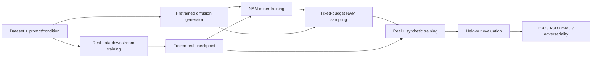

<h1 align="center">🔥 Native Adversariality Mining</h1>
<h3 align="center">Native Adversariality Mining for Diffusion-Driven Medical Generalization</h3>
<p align="center">
  <b>Official PyTorch implementation of the TPAMI 2026 extended version</b>
</p>
<p align="center">
  <a href="https://openaccess.thecvf.com/content/CVPR2026/papers/Zhang_Diffusion-Based_Native_Adversarial_Synthesis_for_Enhanced_Medical_Segmentation_Generalization_CVPR_2026_paper.pdf">
    
  </a>
  <a href="#publications">
    
  </a>
  <a href="pyproject.toml">
    
  </a>
  <a href="https://pytorch.org/">
    
  </a>
  <a href="LICENSE">
    
  </a>
</p>
<p align="center">
  <a href="https://openaccess.thecvf.com/content/CVPR2026/papers/Zhang_Diffusion-Based_Native_Adversarial_Synthesis_for_Enhanced_Medical_Segmentation_Generalization_CVPR_2026_paper.pdf">📄 CVPR Paper</a>
  · <a href="https://openaccess.thecvf.com/content/CVPR2026/supplemental/Zhang_Diffusion-Based_Native_Adversarial_CVPR_2026_supplemental.pdf">📎 CVPR Supplement</a>
  · <a href="docs/TABLE1_PROTOCOL.md">🧪 Reproduction Protocol</a>
  · <a href="docs/EVALUATION_VISUALIZATION.md">📊 Evaluation Guide</a>
</p>
> [!IMPORTANT]
> The preliminary conference paper, **Diffusion-Based Native Adversarial Synthesis for Enhanced Medical Segmentation Generalization**, was selected as a **CVPR 2026 Highlight**. This repository follows the substantially extended TPAMI manuscript, **Native Adversariality Mining for Diffusion-Driven Medical Generalization**, and should be treated as the canonical implementation of the TPAMI version.
🧭 Contents
Overview
News
Highlights
Supported diffusion models
Downstream models
NAM mitigation strategies
Datasets and splits
Compared methods
Installation
Quick start
Monitoring and artifacts
Evaluation and visualization
Repository layout
Publications
Citation
📢 News
August 2026 — The repository was organized around the TPAMI extended version, including ten diffusion adapters, 2D/3D miners, classification and natural-image transfer, four mitigation strategies, and unified experiment tracking.
June 2026 — The preliminary work was presented at CVPR 2026 and selected as a Highlight paper. 🌟
Reproducibility release — Dataset manifests, checkpoint namespaces, fixed-budget sampling, adversariality exports, and real-versus-synthetic evaluation are exposed through stable command-line interfaces.
🔍 Overview
Conventional diffusion augmentation usually samples random initial noise and assumes that all generated examples are equally useful. NAM instead learns a lightweight adversariality miner that transforms random noise into native adversarial noise: the resulting sample remains within the pretrained generator distribution while exposing difficult failure modes of a frozen downstream model.
<p align="center">
  
</p>
<p align="center"><em>NAM replaces random seed selection with a learned adversariality-aware noise transformation; the diffusion generator and downstream anchor remain frozen.</em></p>

The implementation preserves this separation throughout the codebase: each dataset owns its input contract, each generator owns its diffusion-specific hooks, each downstream network owns its official training recipe, and the shared engines connect them without embedding dataset-specific paths.
✨ Highlights
Capability	What is included
🎯 Native adversarial synthesis	Trainable 2D and 3D miners, frozen generator/downstream contracts, configurable LCBCE/LCE/LDice/LFocal proxy rewards, and fixed-budget Base-versus-NAM sampling.
🧬 Ten generator adapters	Pixel-space DPMs, latent diffusion models, joint image-mask generators, volumetric DiTs, MAISI, ControlNet-SDXL, and LoRA-tuned SD-v1.5.
🩺 Medical + natural benchmarks	In-domain, cross-center, cross-modality, classification, and PASCAL VOC+SBD semantic-segmentation protocols.
🧠 Eight downstream families	nnU-Net, Swin-Unet, SwinUNETR, SAMed, ResNet-50, ViT-S/16, DeepLabV3, and Mask2Former, with isolated real and synthetic checkpoint namespaces.
🛡️ Four mitigation strategies	HAT, QSF, LSRS, and ASG for detecting, filtering, reranking, or suppressing undesirable high-adversariality samples.
📈 Publication-grade tracking	TensorBoard scalars/histograms/images, JSONL histories, environment snapshots, preview grids, per-sample adversariality CSV files, t-SNE, cross-model consistency, and FID.
🔌 Unified entry points	All Python entry points expose executable defaults through `argparse`, accept YAML plus dotted overrides, and provide `--dry-run` validation.
Native versus artificial adversariality
<p align="center">
  
</p>
<p align="center"><em>Native adversarial examples preserve the generator manifold and semantic condition more reliably than recursively perturbed artificial adversarial samples.</em></p>
🧩 Supported diffusion models
Every method package contains `model.py`, `pre_training.py`, `sampling.py`, `nam_training.py`, a method-specific `utils/` package, and checkpoint documentation. The adapters retain the algorithmically relevant behavior of the corresponding public implementation while exposing one consistent NAM interface.
Generator	Generation contract	Space	NAM miner	Primary datasets	Implementation and source
SegDiff	mask → image DPM	2D pixel	2D ResUNet	ACDC, Polyps	local · official
DiffBoost	mask → image SD	2D latent	2D ResUNet	ACDC, Synapse, Polyps	local · official
FairDiff	mask → image LDM	2D latent	2D ResUNet	Synapse	local · official
SiameseDiff	mask → image SD	2D latent	2D ResUNet	Polyps	local · official
JoDiffusion	joint image-mask LDM	2D joint latent	single 8-channel ResUNet	ACDC	local · official
MedSegFactory	joint image-mask LDM	2D dual latent	dual image/mask ResUNet	Synapse, Polyps	local · official
VolDiT	mask → volume DiT	3D latent	3D ResUNet	LA, ImageCAS	local · official
MAISI	mask → volume SD	3D latent	3D ResUNet	LA, ImageCAS	local · official
ControlNet-SDXL	semantic mask → image	2D latent	2D ResUNet	PASCAL VOC+SBD	local · ControlNet · SDXL
SD-v1.5 + LoRA	class prompt → image	2D latent	2D ResUNet	PneumoniaMNIST, ISIC	local · SD-v1.5 · LoRA
> [!NOTE]
> Upstream repositories are not vendored. Clone only the method required for an experiment under `third_party/`, then follow that package's `pretrained_weights/README.md`. The repository never assumes a private server, user name, or machine-specific absolute path.
🧠 Downstream models
Real-only training produces the frozen anchor used by NAM and the baseline used to measure generalization. Synthetic training starts from the real checkpoint, trains on the configured real/synthetic mixture, and writes to a separate checkpoint tree.
Model	Dimensionality	Intended branch	Training entry points	Official reference
nnU-Net	2D / 3D	medical segmentation	real · synthetic	MIC-DKFZ/nnUNet
Swin-Unet	2D	medical segmentation	real · synthetic	HuCaoFighting/Swin-Unet
SwinUNETR	3D	volumetric segmentation	shared Swin package and 3D entry point	MONAI SwinUNETR
SAMed	2D / volumetric adapter	medical segmentation	real · synthetic	hitachinsk/SAMed
DeepLabV3-R50	2D	natural-image transfer	real · synthetic	Torchvision
Mask2Former-R50	2D	natural-image transfer	real · synthetic	facebookresearch/Mask2Former
ResNet-50	2D	medical classification	real · synthetic	Torchvision
ViT-S/16	2D	medical classification	real · synthetic	timm
Checkpoint selection is uniform across architectures:
```text
nam/downstream/
|-- real_checkpoint/<dataset>/<model>/
|   |-- best.pt                 # best validation metric
|   |-- latest.pt               # resumable state
|   `-- epoch_0020.pt           # archival checkpoint every 20 epochs
`-- syn_checkpoint/<dataset>/<generator>/<model>/
    |-- best.pt
    |-- latest.pt
    `-- epoch_0020.pt
```
The validation split is used only for checkpoint selection; final results are reported on the held-out test split. See the downstream checkpoint guide for initialization, resume, and directory rules.
🛡️ NAM mitigation strategies
The extended version includes four sampling-time strategies for controlling characteristic failure modes. All strategies keep the diffusion generator, downstream anchor, and trained NAM miner frozen.
Strategy	Purpose	Signal and action	External basis	Code
HAT	Adversariality control	Calibrates a high-adversariality threshold, retries rejected seeds, and retains the lowest-loss candidate when the trial budget is exhausted.	Native adversariality calibration	`hat.py`
QSF	Quality/semantic filtering	Scores the generated image with a condition-contour overlay and accepts samples above a configurable VQA threshold.	VQAScore · MedGemma	`qsf.py`
LSRS	Latent semantic reranking	Compares full, unconditional, and component-conditioned predictions over cached DDIM states to rerank candidate seeds.	CompLift	`lsrs.py`
ASG	Attention-guided suppression	Aligns target-token cross-attention with the condition mask and penalizes conflicting self-attention at selected denoising steps.	InitNO	`asg.py`
HAT and QSF operate through the shared mitigation bridge. LSRS and ASG additionally require diffusion-state or attention hooks and therefore fail explicitly when a generator does not expose the required capability. Configuration and backend contracts are documented in `nam/mitigation/README.md`.
🗂️ Datasets and splits
The release covers 13 public benchmarks, matching Supplementary Table C.1. The combined Polyps and PASCAL VOC+SBD benchmarks each draw from two public sources, while MMWHS is evaluated in separate CT and MRI domains. Data are never redistributed. Each package contains an English preparation guide, portable manifests, prompt templates, augmentations, and a dataset/dataloader factory.
Scenario	Dataset	Modality / task	Train / val / test	Resolution	Download and local interface
In-domain	ACDC	cardiac MRI segmentation	4,010 / 572 / 1,146	256²	official · local
In-domain	Synapse	abdominal CT segmentation	2,645 / 378 / 756	256²	official · local
In-domain / cross-center	CVC-ClinicDB + Kvasir-SEG	RGB polyp segmentation	1,128 / 161 / 323	256²	ClinicDB · Kvasir · local
Volumetric	LA	left-atrium MRI segmentation	70 / 10 / 20	192×192×96	official · local
Volumetric	ImageCAS	coronary CTA segmentation	700 / 100 / 200	192×192×96	official · local
Cross-center	EndoScene / CVC-300	RGB polyp segmentation	— / — / 60	256²	official · local
Cross-center	CVC-ColonDB	RGB polyp segmentation	— / — / 380	256²	benchmark · local
Cross-center	ETIS-LaribPolypDB	RGB polyp segmentation	— / — / 196	256²	benchmark · local
Cross-modality	MMWHS CT	whole-heart CT segmentation	3,714 / 531 / 1,060	256²	official · local
Cross-modality	MMWHS MRI	whole-heart MRI segmentation	2,029 / 290 / 579	256²	official · local
Natural image	PASCAL VOC 2012 + SBD	21-class semantic segmentation	8,422 / 1,203 / 2,406	512²	VOC · SBD · local
Classification	PneumoniaMNIST-224	chest X-ray classification	4,099 / 585 / 1,171	224²	MedMNIST · local
Classification	ISIC	dermoscopic classification	1,925 / 275 / 550	256²	ISIC Archive · local
The checked-in `train.list`, `val.list`, and `test.list` files contain dataset-relative paths only. Exact inventory assumptions and split-generation provenance are recorded in `nam/data/SPLITS.md`. Place images, masks, volumes, and metadata under each dataset's ignored `data/` directory.
PASCAL VOC+SBD transfer branch
The natural-image experiment merges and deduplicates VOC 2012 and SBD, constructs prompts of the form `a photo of [VOC object]`, conditions SDXL through a task-tuned ControlNet, and evaluates DeepLabV3-R50 and Mask2Former-R50 using mIoU. The fixed synthetic budget equals the 8,422-image training set.
```bash
python scripts/train_diffusion_2d.py --config configs/controlnet_sdxl_voc.yaml
python scripts/train_downstream_2d.py --config configs/controlnet_sdxl_voc.yaml --phase real
python scripts/train_nam_2d.py --config configs/controlnet_sdxl_voc.yaml
python scripts/generate_2d.py --config configs/controlnet_sdxl_voc.yaml --method nam
python scripts/train_downstream_2d.py --config configs/controlnet_sdxl_voc.yaml --phase synthetic
python scripts/evaluate_2d.py --config configs/controlnet_sdxl_voc.yaml --checkpoint-phase syn
```
Medical classification transfer branch
PneumoniaMNIST-224 and ISIC use class-aware prompts with a dataset-specific
LoRA adaptation of SD-v1.5. NAM mines the four-channel latent seed, while the
frozen real-data classifier supplies the CE reward. ResNet-50 and ViT-S/16 are
trained and evaluated independently under the same real/synthetic protocol.
```bash
python scripts/train_diffusion_2d.py --config configs/sd15_lora_pneumoniamnist.yaml
python scripts/train_downstream_2d.py --config configs/sd15_lora_pneumoniamnist.yaml --phase real
python scripts/train_nam_2d.py --config configs/sd15_lora_pneumoniamnist.yaml
python scripts/generate_2d.py --config configs/sd15_lora_pneumoniamnist.yaml --method nam
python scripts/train_downstream_2d.py --config configs/sd15_lora_pneumoniamnist.yaml --phase synthetic
python scripts/evaluate_classification.py --config configs/sd15_lora_pneumoniamnist.yaml
```
⚖️ Compared methods
The manuscript evaluates NAM against random base-DM sampling and representative heuristic, diversity-oriented, utility-proxy, and adversarial-guidance approaches. This table is an experiment index, not a claim that third-party comparison implementations are redistributed in this repository. Follow the linked papers and their licenses when reproducing a comparison.
Family	Method	Reference	Repository status
Baseline	Base DM	Random initial-noise sampling with the matched generator and budget	Built into `generate_2d.py` / `generate_3d.py` via `--method base`
Heuristic targeting	UGDM	Measurement Guidance in Diffusion Models	Paper comparison; external implementation
Heuristic targeting	VGD	Value-Guided Diffusion toward High-Utility Medical Image Segmentation	Paper comparison; external implementation
Diversity-oriented	AugPaint	arXiv:2506.23038	Paper comparison; external implementation
Diversity-oriented	DiffAug	Diffuse-and-Denoise Augmentation	Paper comparison; external implementation
Diversity-oriented	CIG	Inversion Circle Interpolation	Paper comparison; external implementation
Diversity-oriented	DA-Fusion	Effective Data Augmentation with Diffusion Models	Paper comparison; external implementation
Utility-proxy	GAL	Generative Active Learning for Long-Tailed Instance Segmentation	Paper comparison; external implementation
Utility-proxy	UtilGen	NeurIPS proceedings search	Paper comparison; external implementation
Adversarial guidance	AdvDiffuser	ICCV 2023 paper	Paper comparison; external implementation
Adversarial guidance	P2P	Prompt2Perturb, CVPR 2025	Paper comparison; external implementation
Adversarial guidance	Diff-PGD	Diffusion-Based Adversarial Sample Generation, NeurIPS 2023	Paper comparison; external implementation
Adversarial guidance	DiffAttack	Diffusion Models for Imperceptible and Transferable Adversarial Attack	Paper comparison; external implementation
Adversarial guidance	NatADiff	arXiv:2505.20934	Paper comparison; external implementation
Proposed	NAM	CVPR Highlight and TPAMI extended version	Fully implemented in this repository
⚙️ Installation
Requirements
Python 3.10 or newer
PyTorch 2.1 or newer
CUDA-capable GPU for diffusion/NAM training; CPU is sufficient for configuration dry runs
Linux is recommended for full experiments; path handling remains platform-independent
Environment
```bash
git clone https://github.com/JackCD99/Native-Adversariality-Mining.git
cd Native-Adversariality-Mining

python -m venv .venv
source .venv/bin/activate
python -m pip install --upgrade pip

pip install -e .
pip install -e ".[medical,diffusion,natural,classification,visualization]"
```
On Windows, activate the environment with `.venv\Scripts\activate`. Install the PyTorch build appropriate for the local CUDA version before installing optional dependencies.
Pretrained weights
Method weights are deliberately excluded from Git. Keep all externally downloaded assets beneath their documented package directory:
```text
nam/diffusion/<family>/<method>/pretrained_weights/
|-- README.md          # source URL, expected filename, license, checksum notes
`-- <checkpoint>       # ignored by Git
```
Downstream checkpoints are created by the training scripts and must not be mixed with upstream diffusion weights. No script silently downloads a model or rewrites an existing checkpoint.
🚀 Quick start
1. Inspect the experiment matrix
```bash
python scripts/list_table1.py
python scripts/train_nam_2d.py --config configs/table1_2d.yaml --dry-run --print-config
```
`--dry-run` validates configuration resolution and imports configured dataset
factories without loading data, model weights, or starting optimization.
2. Prepare one dataset
Follow the dataset-specific README, copy the raw assets into its `data/` directory, and keep the supplied relative manifests:
```text
nam/data/acdc/
|-- README.md
|-- dataset.py
|-- train.list
|-- val.list
|-- test.list
|-- test_prompts.jsonl
`-- data/
```
3. Train or register the generator
```bash
python scripts/train_diffusion_2d.py --config configs/segdiff_2d.yaml
```
If an official pretrained checkpoint is used, place it at the location specified by the method README and point the YAML field to that file. Volumetric experiments use `train_diffusion_3d.py`.
4. Train the real-only downstream baseline
```bash
python scripts/train_downstream_2d.py --config configs/table1_2d.yaml --phase real
```
This step creates `best.pt`, `latest.pt`, and 20-epoch archival checkpoints under `nam/downstream/real_checkpoint/`. NAM loads the validation-selected `best.pt` as its frozen downstream anchor.
5. Train NAM
```bash
python scripts/train_nam_2d.py --config configs/table1_2d.yaml
```
Select the adversarial proxy through the configuration:
```bash
python scripts/train_nam_2d.py \
  --config configs/table1_2d.yaml \
  --set nam_training.reward=lce \
  --set nam_training.visualization.sample_every=100
```
Available NAM objectives include `lce` (paper default), `ldice`, `lfocal`, and `lcbce`. The fixed-budget adversariality analyzer retains `lcbce` as its default ranking proxy. Training logs the original noise, mined noise, displacement, decoded sample, condition, frozen-model prediction, error map, and objective components.
6. Sample a fixed synthetic budget
```bash
python scripts/generate_2d.py --config configs/table1_2d.yaml --method nam
python scripts/generate_2d.py --config configs/table1_2d.yaml --method base
```
Each generated record includes a stable ID, source condition, prompt, seed, generator/miner checkpoint identity, output path, and sampling metadata. Use the same budget and condition list for Base and NAM.
7. Train with synthetic data and evaluate
```bash
python scripts/train_downstream_2d.py --config configs/table1_2d.yaml --phase synthetic
python scripts/evaluate_2d.py --config configs/table1_2d.yaml --checkpoint-phase real
python scripts/evaluate_2d.py --config configs/table1_2d.yaml --checkpoint-phase syn
python scripts/evaluate_adversariality.py --config configs/table1_2d.yaml
python scripts/evaluate_fid.py --config configs/table1_2d.yaml
```
Use the corresponding `_3d.py` entry points with `configs/table1_3d.yaml` for volumetric experiments. Every command has operational parser defaults, so a prepared default configuration can also be run directly as `python <script>.py`.
📈 Monitoring and artifacts
Generator, NAM, downstream, and sampling runs use a shared artifact contract.
Artifact	Contents
`tensorboard/`	Objectives, component losses, DSC/ASD/mIoU, learning rate, gradient/parameter statistics, noise histograms, previews, errors, and Base/NAM differences
`metrics.jsonl`	Append-only machine-readable step/epoch metrics
`config.json`	Fully resolved configuration after YAML and CLI overrides
`environment.json`	Python, PyTorch, CUDA, host, device, and package provenance
`visualizations/`	PNG panels for fast remote inspection without TensorBoard
`samples.jsonl`	Stable sample IDs, conditions, prompts, seeds, checkpoints, and output paths
`checkpoints/`	Best, latest, and periodic training states with optimizer/scheduler metadata
Launch TensorBoard over an experiment root:
```bash
tensorboard --logdir outputs --port 6006
```
The main visualization frequencies are configurable through `sample_every`, `histogram_every`, `downstream_image_every`, and `sampling_image_every`. Representative center slices and orthogonal views are logged for 3D experiments.
📊 Evaluation and visualization
Tool	Output	Entry point or module
Segmentation evaluation	DSC, ASD, mIoU, class-wise and aggregate summaries	`scripts/evaluate_2d.py`, `scripts/evaluate_3d.py`
Classification evaluation	Accuracy, balanced accuracy, and specificity	`scripts/evaluate_classification.py`
Adversariality distribution	Mean adversariality plus per-sample `id`, path, LCE, LCBCE, LDice, selected proxy score, and prediction score	`adversariality_evaluator.py`
Distribution fidelity	FID and cached feature statistics	`scripts/evaluate_fid.py`
Bottleneck-space t-SNE	Real/Base/NAM embedding plots using downstream bottleneck features	`tsne.py`
Cross-model consistency	Sample ranking agreement across downstream architectures	`cross_model_consistency.py`
Adversariality plots	Histograms, KDE/CDF views, sample ranking, and group summaries	`adversariality_distribution.py`
All evaluation loaders consume the same manifests as training and preserve sample IDs through the output CSV/JSON files. Plotting modules contain no private paths and accept explicit feature, prediction, or metric files.
🗃️ Repository layout
```text
Native-Adversariality-Mining/
|-- assets/                         README figures
|-- configs/                        method, dataset, and experiment YAML files
|-- docs/                           protocols and evaluation documentation
|-- nam/
|   |-- data/                       dataset packages and portable manifests
|   |-- diffusion/
|   |   |-- 2D_M2I/                2D mask-to-image generators
|   |   |-- 2D_M&I/                joint 2D image-mask generators
|   |   |-- 2D_T2I/                class-conditional text-to-image generator
|   |   `-- 3D_M2I/                volumetric mask-to-image generators
|   |-- downstream/                 architectures and phase-specific trainers
|   |   |-- real_checkpoint/        real-only baselines and NAM anchors
|   |   `-- syn_checkpoint/         synthetic-trained evaluation models
|   |-- engine/                     stable generator/downstream dispatch APIs
|   |-- evaluation/                 metrics, adversariality, FID, and figures
|   |-- mitigation/                 HAT, QSF, LSRS, and ASG
|   `-- utils/                      configuration, logging, seeds, and I/O
|-- scripts/                        executable CLI workflows
|-- pyproject.toml
`-- requirements.txt
```
Further documentation:
🌳 Complete pipeline tree
🧪 Table I protocol
📊 Evaluation and visualization
🗂️ Dataset split inventory
🧠 Downstream checkpoint contract
🛡️ Mitigation backend contract
🧬 FID encoder weights
📚 Publications
TPAMI 2026 extended version
Native Adversariality Mining for Diffusion-Driven Medical Generalization  
Hongyu Zhang, Haipeng Chen, Yu Wang, Zhimin Xu, Chengxin Yang, and Yingda Lyu  
Submitted to IEEE Transactions on Pattern Analysis and Machine Intelligence (TPAMI), 2026.
The main branch is organized around this version: it adds the broader generator taxonomy, volumetric synthesis, joint image-mask generation, natural-image transfer, mitigation strategies, adversariality analysis, and the unified evaluation/visualization stack.
CVPR 2026 Highlight
Diffusion-Based Native Adversarial Synthesis for Enhanced Medical Segmentation Generalization  
Hongyu Zhang, Haipeng Chen, Zhimin Xu, Chengxin Yang, and Yingda Lyu  
IEEE/CVF Conference on Computer Vision and Pattern Recognition (CVPR), 2026, Highlight.
🧾 Citation
If this repository is useful for your research, please cite the TPAMI extended manuscript and the CVPR Highlight paper as appropriate:
```bibtex
@article{zhang2026mining,
  title   = {Native Adversariality Mining for Diffusion-Driven Medical Generalization},
  author  = {Zhang, Hongyu and Chen, Haipeng and Wang, Yu and Xu, Zhimin and Yang, Chengxin and Lyu, Yingda},
  journal = {IEEE Transactions on Pattern Analysis and Machine Intelligence},
  year    = {2026},
  note    = {Submitted}
}

@inproceedings{zhang2026diffusion,
  title     = {Diffusion-Based Native Adversarial Synthesis for Enhanced Medical Segmentation Generalization},
  author    = {Zhang, Hongyu and Chen, Haipeng and Xu, Zhimin and Yang, Chengxin and Lyu, Yingda},
  booktitle = {Proceedings of the IEEE/CVF Conference on Computer Vision and Pattern Recognition},
  pages     = {1461--1471},
  year      = {2026},
  note      = {Highlight}
}
```
Please also cite the generator, downstream architecture, and dataset used in each experiment. Upstream sources are linked in the corresponding package README files and stored in generated-sample provenance.
🤝 Acknowledgements and license
This project builds on open-source work from the diffusion, medical-imaging, segmentation, and evaluation communities. Method-specific source links, pinned revisions where applicable, pretrained-weight instructions, and third-party license notes are maintained beside each adapter.
The repository code is released under the Apache License 2.0. Dataset licenses, pretrained weights, model checkpoints, and third-party repositories remain subject to their original terms and are not redistributed here.
🛠️ Troubleshooting
Symptom	Recommended check
Import or registry error	Run the target command with `--dry-run --print-config`; confirm the selected optional dependency group is installed.
Dataset file not found	Verify that manifest paths are relative to the dataset package's `data/` directory and that the documented preprocessing layout is preserved.
Diffusion checkpoint mismatch	Compare the configured filename, latent channels, condition channels, scheduler, and upstream revision with `pretrained_weights/README.md`.
NAM shape mismatch	Confirm the generator adapter's noise specification and miner dimensionality (2D versus 3D) before loading the miner checkpoint.
CUDA out of memory	Reduce batch size, patch/volume size, preview count, or mixed-precision policy; do not silently change the reported synthetic budget.
Missing `best.pt`	Complete real-data validation first; NAM intentionally refuses to use an unvalidated downstream checkpoint.
For a reproducible issue report, include the resolved `config.json`, `environment.json`, the exact command, and the first complete traceback. Do not attach private datasets or restricted checkpoints.
